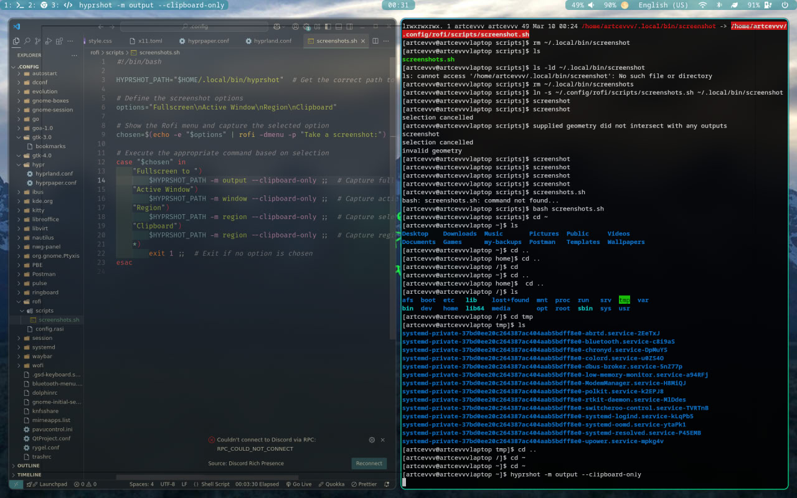
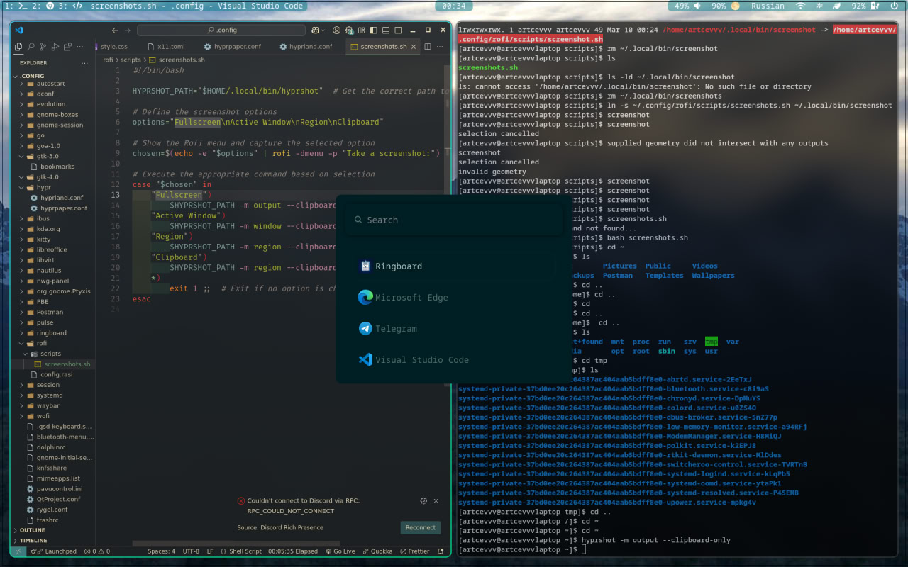
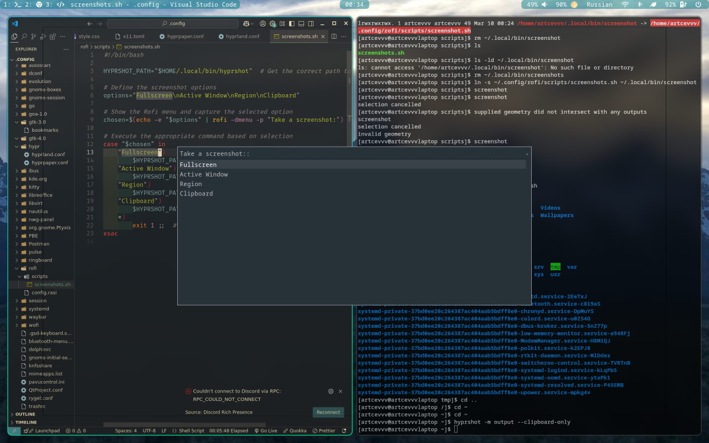

# artcevvv's dotfiles

some custom code and compilation of my favorite colors for the most comfortable use for me personally

## Screenshots

## Prerequisites

- [hyprland](https://hyprland.org/) (obviously)
- [rofi](https://github.com/davatorium/rofi)
- [wofi](https://github.com/SimplyCEO/wofi)
- [waybar](https://github.com/Alexays/Waybar)
- [bluetui](https://github.com/pythops/bluetui) (for searching bluetooth devices)
